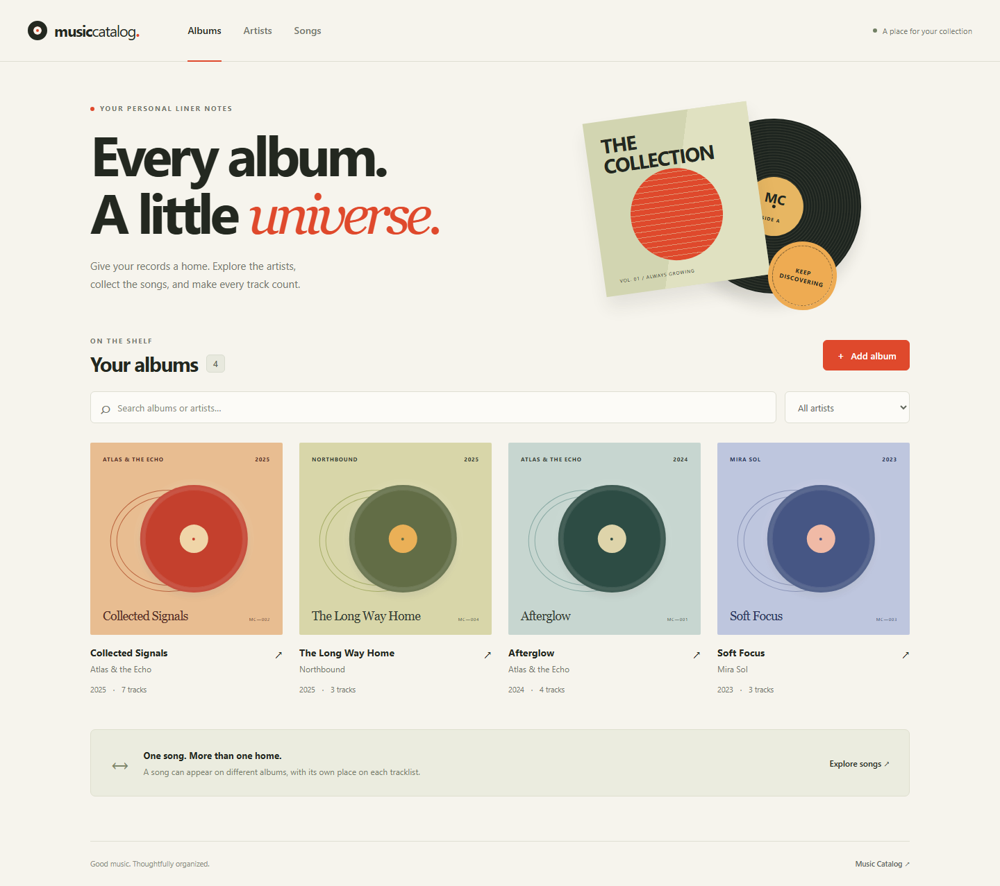

# Music Catalog

A small music library with reusable songs and an ordered tracklist editor, built with Django REST Framework and Vue 3.



## Features

- Browse and edit albums, artists and songs with search and pagination.
- Reuse one song on several albums, with a different position on each.
- Drag tracks or use keyboard-friendly move buttons, then save the order atomically.
- Search existing songs or create a song directly inside an album.
- See every album a song appears on, with its artist and track number.
- Explore a seeded catalog immediately; Django Admin is also available.

## Architecture

```text
Vue 3 + Vite  →  same-origin proxy  →  Django REST API  →  PostgreSQL

Artist  →  Album  →  AlbumTrack  →  Song
                      └── track_number
```

`AlbumTrack` is an explicit through model: a track number describes a song's placement on an album.
It is not a property of the song. Database constraints prevent duplicate positions and duplicate song
placements within an album. Song titles are deliberately not unique.

## Quick start

Install Docker with Compose v2. From the cloned repository:

```sh
cp .env.example .env
docker compose up --build
```

In PowerShell, `Copy-Item .env.example .env` is equivalent to the first command.
Open **http://localhost:5173** after the services report healthy. The first build downloads dependencies.
No host Python, Node or PostgreSQL installation is needed. If port 5173 is occupied, change `APP_PORT` in `.env`.

The example credentials are for this local development stack. Only the frontend is exposed, on loopback.
Stop with `Ctrl+C`, or use `docker compose down`; the database volume is retained.

## Demo data

The first start loads a small fictional catalog, including the same song at position 2 on one album
and position 7 on another. Loading is idempotent:

```sh
docker compose exec backend python manage.py seed_demo
```

Set `SEED_DEMO=false` to start without demo data. Existing records are not cleared on restart.
To use [Django Admin](http://localhost:5173/admin/), create your own staff account:

```sh
docker compose exec backend python manage.py createsuperuser
```

Album placements are read-only in Admin so all track mutations preserve the revision contract.

For a quick review, open **Songs → Satellite Hearts → Appears on**: the same song is track 2 on
**Afterglow** and track 7 on **Collected Signals**. Open either album, move a track and save the order,
then reload to see it persist. Use **Add song** to reuse a song or create one inline.

## Tests

With the stack running:

```sh
docker compose exec backend python manage.py check
docker compose exec backend python manage.py makemigrations --check --dry-run
docker compose exec backend pytest
docker compose exec backend ruff check .
docker compose exec backend ruff format --check .
```

Tests use PostgreSQL, including real concurrent transactions. The frontend image build runs its
type check, unit tests and production build. `docker compose build frontend` repeats those checks.

With Python 3.12+ installed on the host, `python scripts/verify.py` runs the complete local gate,
including the HTTP smoke test, and records commands, outputs and exit codes under `.local/verification/`.
For a custom port, pass its URL: `python scripts/verify.py http://localhost:5174`.
GitHub Actions runs the same script from a fresh checkout.

Optional real-browser acceptance (Python 3.12+):

```sh
pip install -r scripts/requirements-browser.txt
python -m playwright install chromium
python scripts/browser_smoke.py
```

This exercises creation/editing, shared-song appearances, keyboard and pointer reordering,
stale-save protection and mobile layout. It removes its own test records and saves screenshots
under `.local/browser/`. Run it against the seeded development catalog.

## API

| Endpoint | Operations |
| --- | --- |
| `/api/artists/`, `/api/artists/{id}/` | List, create, retrieve, edit, delete |
| `/api/albums/`, `/api/albums/{id}/` | List, create, retrieve with ordered tracks, edit, delete |
| `/api/songs/`, `/api/songs/{id}/` | List, create, retrieve with appearances, edit, delete |
| `/api/albums/{id}/tracks/` | POST an existing `song` ID or a new `title` |
| `/api/albums/{id}/tracks/{track_id}/` | DELETE a placement, preserving its Song |
| `/api/albums/{id}/tracks/reorder/` | PUT `{ "track_ids": [3, 1, 2], "revision": 4 }` |
| `/api/health/` | Database readiness |

Lists accept `?search=...` and `?page=2`; albums also accept `artist` and `release_year` filters.
Validation uses DRF field errors. Stale reorder and protected deletion return HTTP 409.
See [SPEC](docs/SPEC.md) for the full behavior contract.

## Design decisions and trade-offs

- PostgreSQL enforces the important domain rules and is also the test database.
- Parent-album locking plus revision checks prevents stale tracklist saves; reorder preserves song identities.
- Vue keeps a local edit draft. This app does not need a global Pinia store.
- Same-origin requests keep the setup small and avoid broad CORS permissions.
- The demo API intentionally has no authentication. Public deployment, streaming and third-party integrations are out of scope.

Short rationales live in [DECISIONS](docs/DECISIONS.md); [verification evidence](docs/VERIFICATION.md)
records the exercised checks and their limits.

Author: **Sarayeu Aliaksei** · [rusenglishvideos@gmail.com](mailto:rusenglishvideos@gmail.com)
